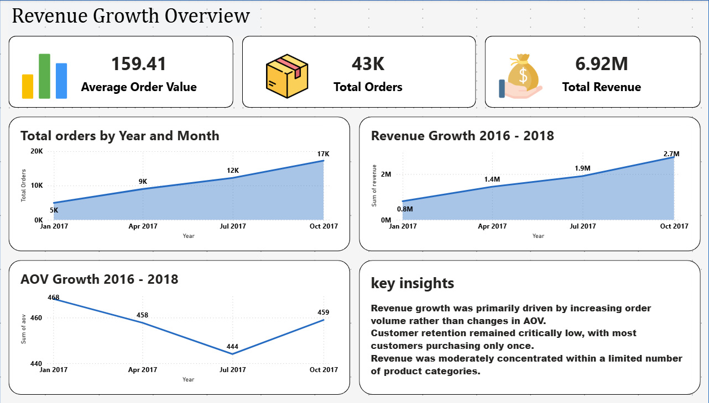
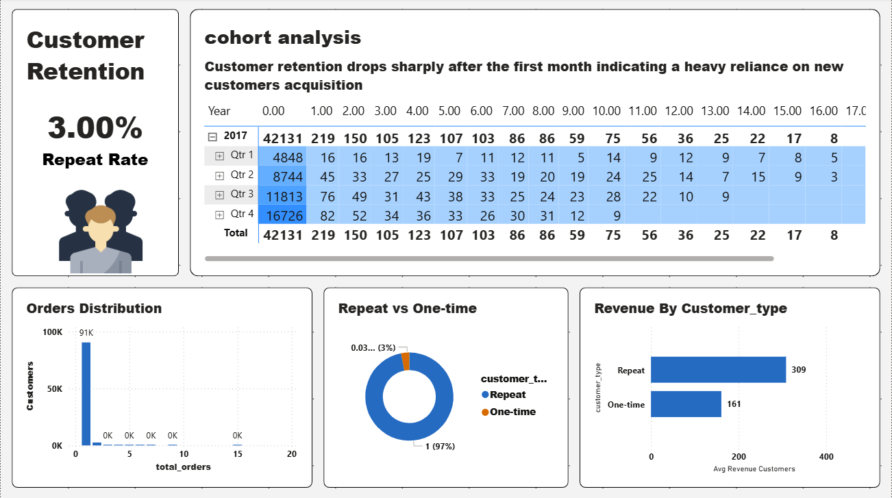
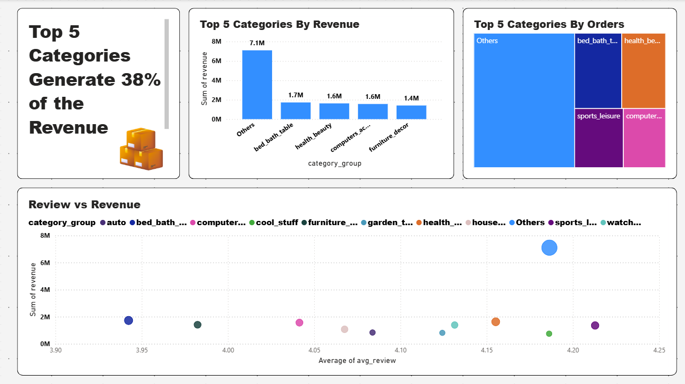
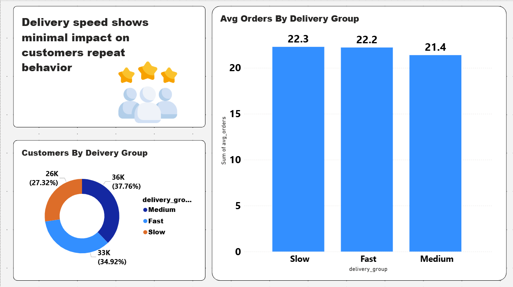

# Customer Retention & Revenue Growth Analysis

> **Context:** This project started as two separate analyses — one for revenue, one for customer behavior.  
> During the work, I realized both were answering the same business question from different angles.  
> This is where I first connected them into one analytical story.
>
> A more structured version of this thinking, built with a full hypothesis framework, is here:  
> 👉 [TheLook E-Commerce — Customer Retention Analysis](https://github.com/MEQDAD0904/thelook-ecommerce-customer-retention-analysis-)

---

## The Business Question

**What drives revenue growth — and is that growth sustainable?**

This led to four connected questions:
- Is revenue growing because of more orders, or higher order value?
- Are customers returning after their first purchase?
- Which product categories carry the most revenue weight?
- Do delivery speed or review scores explain repeat behavior?

---

## Dataset

**Olist Brazilian E-commerce Dataset**

| Table | Content |
|---|---|
| Orders | Transaction records |
| Customers | Customer profiles |
| Payments | Payment details |
| Order Items | Product-level detail per order |
| Products | Product catalog |
| Reviews | Customer satisfaction scores |

---

## Tools

---

## Analysis & Findings

### 1. Revenue Overview

Revenue grew from 0.8M to 2.7M between Jan–Oct 2017. Order volume followed the same curve — from 5K to 17K orders.

AOV stayed flat (444–468), confirming that **growth was volume-driven, not price-driven.**

---

### 2. Customer Retention

97% of customers placed only one order. Repeat rate: **3%**.

The cohort table shows a sharp drop immediately after the first month — across all quarters. This means the retention problem is structural, not seasonal.

Repeat customers generate significantly more average revenue (309) vs one-time buyers (161) — making retention a high-leverage opportunity.

---

### 3. Product Analysis

Top 5 categories generated **38% of total revenue**. The scatter plot between review score and revenue showed no clear pattern — high-revenue categories did not consistently receive higher ratings.

> This suggested review score alone is not a reliable predictor of revenue concentration.

---

### 4. Delivery Speed & Reviews

Average orders by delivery group: Slow (22.3), Fast (22.2), Medium (21.4).

The difference is minimal — **delivery speed showed no measurable impact on repeat behavior** in this dataset.

> Note: This was an observational finding, not a controlled test. Causation cannot be confirmed without further hypothesis testing.

---

## What I Learned

This project changed how I think about analysis.

I started with two separate dashboards. By the end, I realized they were answering the same question from different angles — revenue numbers don't explain themselves, they're the result of customer decisions and product patterns working together.

The biggest gap I noticed in my own work: I was asking good questions, but without a structured hypothesis before touching the data. That gap is what I addressed in the next project:  
👉 [TheLook E-Commerce — Customer Retention Analysis](https://github.com/MEQDAD0904/thelook-ecommerce-customer-retention-analysis-)

---

## Project Files

| File | Description |
|---|---|
| `analysis.sql` | PostgreSQL queries |
| `visuals/overview.png` | Revenue growth dashboard |
| `visuals/retention.png` | Cohort and retention dashboard |
| `visuals/products.png` | Product revenue concentration |
| `visuals/reviews.png` | Delivery and review analysis |
